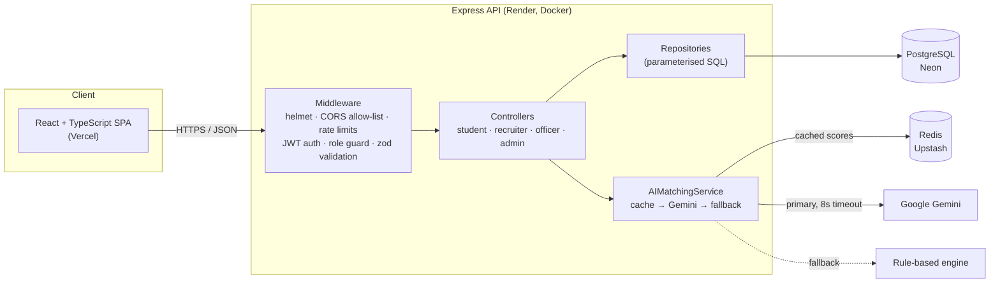
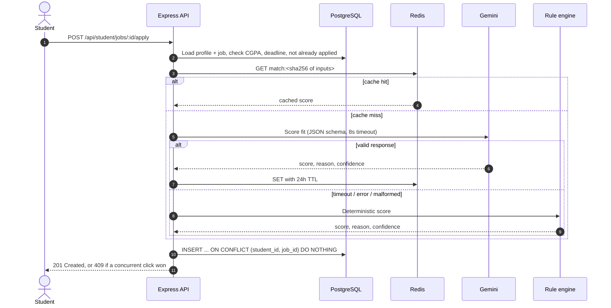
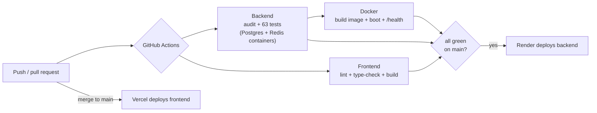

# PlacementAI: AI-Powered Placement Management Platform

[](https://github.com/priyxnshu07/AI-Powered-Placement-Management-Platform/actions/workflows/ci.yml)
[](https://ai-powered-placement-management-pla.vercel.app)


A full-stack platform that connects a college's students, recruiters and placement office. Students apply to jobs and get an **AI match score** with a one-line explanation; recruiters see applicants ranked by fit; the placement office tracks outcomes across the whole cohort.

**[▶ Try the live demo](https://ai-powered-placement-management-pla.vercel.app)**

> The backend runs on a free tier that sleeps when idle. The first request can take up to a minute; the app shows a "waking up" notice until it's ready.

| Role | Email | Password |
|---|---|---|
| Student | `student1@college.edu` | `student123` |
| Recruiter | `rec1@techcorp.com` | `recruiter123` |
| Placement officer | `officer@placement.dev` | `officer123` |
| Admin | `admin@placement.dev` | `admin123` |

---

## The project in brief (STAR)

**Situation.** Campus placements run on spreadsheets and email. Students apply blindly, recruiters manually screen hundreds of profiles, and the placement office has no live view of who is placed.

**Task.** Build one system for all four roles, with automated screening that stays reliable even when the AI is slow or unavailable, and make it production-grade: secure, tested, and deployed.

**Action.**
- Designed a **layered Express backend** (routes → controllers → services → repositories) with role-based access control, and a **React + TypeScript** frontend using React Query.
- Built a **dual-engine matcher**: Google Gemini scores semantic fit; a deterministic rule-based engine takes over automatically on timeout, error or malformed output.
- Added a **Redis cache** for AI scores, keyed by a hash of the exact inputs, so identical matches never pay for a second LLM call.
- Audited the codebase, reproduced and fixed **data-integrity and authorization bugs** (race conditions, cross-company data access, mass assignment), each locked in by a regression test.
- Set up **CI/CD**: every push runs tests against real Postgres and Redis, lints and builds the frontend, and builds and boots the Docker image. Production deploys only after CI passes.

**Result.**
- Live on Vercel + Render with managed Postgres (Neon) and Redis (Upstash).
- **63 automated tests** (29 unit, 34 integration against real Postgres). Each fixed bug has a regression test, and re-introducing those bugs was verified to fail the suite.
- **0 known vulnerabilities** in production dependencies; CI fails on any high-severity `npm audit` finding.

---

## Architecture



### What happens when a student clicks "Apply"



---

## Features

**Students:** profile with skills and CGPA · eligible-job list (filtered by CGPA and deadline) · one-click apply with AI match score and reason · application and interview tracking

**Recruiters:** post jobs · applicants ranked by AI score · move candidates through shortlist → interview → offer · schedule interviews

**Placement officer:** placement rate, average package, branch-wise stats and top recruiters · full student list

**Admin:** create and deactivate users (deactivation revokes access immediately) · AI confidence threshold

---

## Engineering highlights

| Problem | Solution |
|---|---|
| Two fast clicks on "Apply" created duplicate applications (check-then-insert race) | `UNIQUE (student_id, job_id)` plus `INSERT … ON CONFLICT DO NOTHING`; the database, not the app, guarantees one application. A test fires 10 concurrent requests and asserts exactly one succeeds. |
| Any recruiter could view or reject another company's candidates | Ownership check on every recruiter route; non-owned records return 404 so their existence isn't revealed. |
| Students could mark themselves "placed" by adding a field to the request | zod schemas whitelist each role's writable fields; `is_placed` is set only when an offer is made, in the same transaction. |
| A slow or failing LLM call blocked the request, and malformed output could reach the database | 8s timeout, JSON-schema-constrained output, zod validation of the response, automatic fallback to the rule engine. |
| Paying for the same LLM answer repeatedly | Redis cache keyed by a SHA-256 of the exact inputs. Editing skills or a job changes the key, so stale entries are never read. Concurrent identical requests share one call. |
| A deactivated user kept access until their JWT expired | Auth middleware re-checks the account on every request. |
| An optional dependency (Redis) could crash the whole API | Cache failures degrade to "uncached", including a malformed `REDIS_URL`, and never log the secret. |

---

## Tech stack

| Layer | Technologies |
|---|---|
| Frontend | React 19, TypeScript, Vite, React Router 7, TanStack Query, Axios |
| Backend | Node.js 22, Express 4, zod, JSON Web Tokens, bcryptjs, express-rate-limit, helmet |
| Data | PostgreSQL (Neon), Redis (Upstash) |
| AI | Google Gemini (`@google/genai`) with a rule-based fallback |
| Testing | Jest, Supertest |
| DevOps | Docker, GitHub Actions, Dependabot, Render (backend), Vercel (frontend) |

---

## Run it locally

**Prerequisites:** Node.js 22+, Docker.

```bash
# 1. Start Postgres and Redis
docker compose up -d postgres redis

# 2. Backend (auto-creates tables and seeds the demo accounts)
cd backend
cp .env.example .env        # add GEMINI_API_KEY to enable LLM matching (optional)
npm install
npm run dev                 # http://localhost:3000

# 3. Frontend (in a second terminal)
cd frontend
cp .env.example .env        # VITE_API_URL=http://localhost:3000/api
npm install
npm run dev                 # http://localhost:5173
```

Without a Gemini key, matching uses the rule-based engine; without Redis, the app runs uncached. Neither is required to run the app.

### Tests

```bash
docker exec placement-postgres psql -U admin -d placement_db -c "CREATE DATABASE placement_test"
cd backend
npm test                    # unit + integration
```

---

## CI/CD



- **Render** deploys `main` only when CI passes (`autoDeployTrigger: checksPass` in [`render.yaml`](render.yaml)).
- **Vercel** builds the frontend from `frontend/` with the backend URL baked in via `VITE_API_URL`.
- **Dependabot** opens weekly dependency updates; CI validates each one.

---

## Project structure

```text
.
├── backend/
│   ├── src/
│   │   ├── ai/            # Gemini provider, rule-based provider, response schema
│   │   ├── cache/         # Redis cache with graceful degradation
│   │   ├── controllers/   # Role-specific request handlers
│   │   ├── database/      # Idempotent schema + migrations, demo seed
│   │   ├── interfaces/    # Contracts the providers and repositories implement
│   │   ├── middleware/    # Auth, role guard, validation, rate limits, errors
│   │   ├── repositories/  # All SQL lives here
│   │   ├── routes/        # Route → middleware → controller wiring
│   │   ├── services/      # AIMatchingService (cache → primary → fallback)
│   │   ├── validators/    # zod request schemas
│   │   ├── app.js         # Express app (no side effects; imported by tests)
│   │   └── server.js      # Boot, migrations, graceful shutdown
│   ├── tests/             # unit/ and integration/ (Jest + Supertest)
│   └── Dockerfile
├── frontend/
│   └── src/
│       ├── api/           # Typed API client
│       ├── components/    # Shared and student UI
│       ├── pages/         # One folder per role
│       └── types/         # API response and payload types
├── .github/workflows/ci.yml
├── docker-compose.yml
└── render.yaml
```

---

## Roadmap

- Show AI match scores on the job list before applying (reusing the Redis cache).
- Resume upload with automatic skill extraction.
- Persist the admin AI threshold in the database (currently in-memory).
- Shared rate-limit store in Redis for multi-instance deployments.

---

Built by **Priyanshu Parashar** · [GitHub](https://github.com/priyxnshu07) · [LinkedIn](https://linkedin.com/in/priyanshu-p-24a682282)
